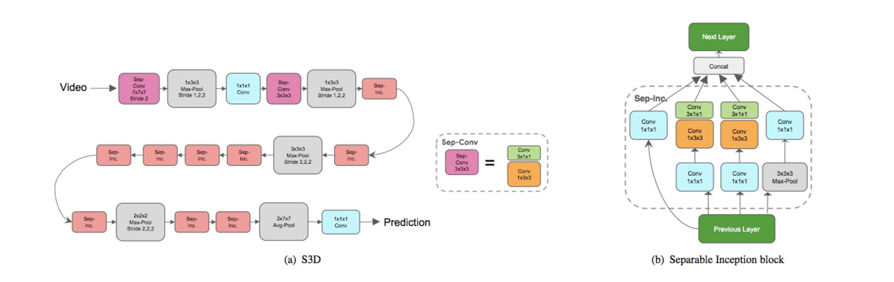

# s3d.pytorch
Spatiotemporal-separable 3D convolution network.

### About the repo

This is a demo code for training videos / continuous frames. I reproduced S3D and initialize the weights with pretrained I3D. The deep learning framework is **PyTorch**.

S3D is powerful, only RGB stream could achieve 96.8% at UCF101, and flow-S3D also gains a large margin compared with I3D. **So S3D is useful for extracting serial features**(equals to TxHxW type data)



-------

### Prepare

##### 0. Install some required python libraries as in [yjxiong/tsn-pytorch](https://github.com/yjxiong/tsn-pytorch).

##### 1. Download the pretrained I3D networks:


[BaiduYun](https://pan.baidu.com/s/1eOvFvyJvyrPaIZblYwILvA)(I3D pretrained on Kinetics)

Then move the weights to a directory:

```
mkdir modelweights
mv /path/to/weights modelweights/
```


2. Test the S3DG architecture:

```
python S3DG_Pytorch.py
// output is (2L, 400L)

```


3. Prepare data. The code read data from pkl files. This step is flexible. You just need to rewrite a \_\_getitem__() function.

4. Then tune parameters and path in trainval.py, specify arguments in run_train.sh and run the training script.

```
sh run_train.sh
```

Reproducing the results at **Kinetics dataset** in raw papers is difficult, Note this(in paper):

```
Our models are implemented with TensorFlow and optimized with a
vanilla synchronous SGD algorithm with momentum of 0.9
and on 56 GPUs. We use batch of 6 per GPU, and train our
model for 80k steps with an initial learning rate of 0.1. We
decay the learning rate at step 60k to 0.01, and step 70k to
0.001.
```

### To do:

train weights or transfer weights.

feature extracting code.

----------

#### references
[1] S3D: Rethinking Spatiotemporal Feature Learning For Video Understanding.

[2] I3D: Quo Vadis, Action Recognition? A New Model and the Kinetics Dataset
